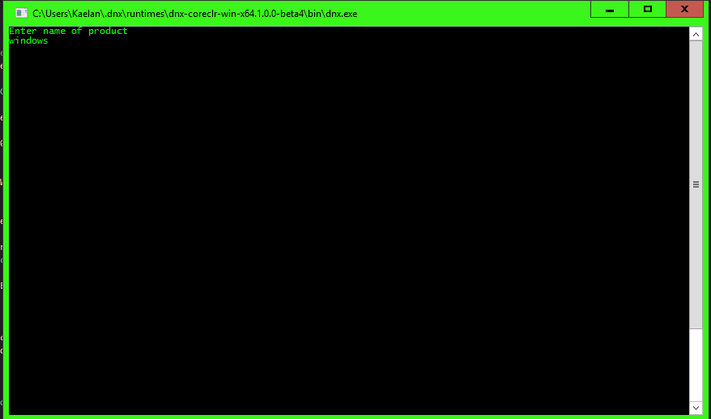
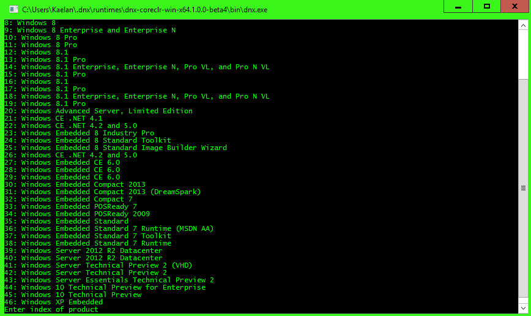
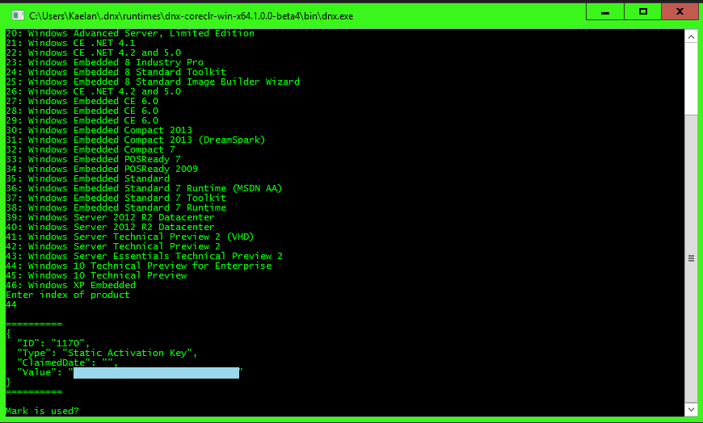

MSDN Key Manager
======

Export xml keys as xml, leave as 'KeysExport.xml'

Put in route directory if building through VS, or in same dir as the build executable. I'll add a command line flag for file path.. later.

Build/Run crossplatform to DNX core

	//dvmn use default -r coreclr
	dnu restore
	dnx . run

